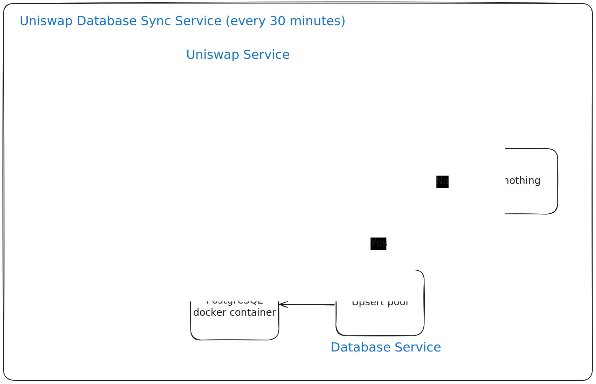
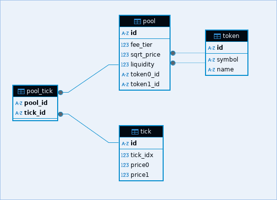

# Backend Developer Test

## Build a NestJS Backend Application with Periodic Subgraph Data Synchronisation

### Objective

Develop a NestJS backend application in TypeScript that periodically fetches data from the UniswapV3 subgraph and stores the data in a database.

#### Requirements

- [x] Set up a new NestJS project with TypeScript.
- [x] Develop a comprehensive solution to synchronize UniswapV3 pool and tick data into a PostgreSQL database using NestJS, enabling accurate pricing calculations. Additionally, explain the rationale behind the chosen architecture and structure.
- [x] Create a service to fetch data from the UniswapV3 subgraph using the GraphQL query examples provided in their documentation (<https://docs.uniswap.org/api/subgraph/guides/examples>).
- [x] Implement functions in the service to parse the fetched data and store it in the respective tables, updating existing entries if necessary.
- [x] Set up a periodic task to fetch data from the UniswapV3 subgraph and synchronize the data in the database every 30 minutes.
- [x] Provide clear instructions on how to set up the application and run it locally.
- [x] Make the structure easily extendable and scalable.

#### Deliverables

- [x] A newly created NestJS project using TypeScript with the configuration files and initial setup documentation.
- [x] SQL scripts or ORM models for creating the tables in the PostgreSQL database.
- [x] A service to fetch data from the UniswapV3 subgraph using the provided GraphQL queries.
- [x] Source code of the service with methods to fetch and parse data.
- [x] Source code implementing a solution to synchronize UniswapV3 data into the PostgreSQL database.
- [x] Documentation explaining the rationale behind the chosen architecture and structure.
- [x] Clear instructions on how to set up the application and run it locally.

#### Bonus

- [ ] Instead of GraphQL, collect data from the ethereum blockchain using the ethers library.
- [x] The solution is performance optimised and scalable from database and NestJS side also.
- [x] Attention to details concerning concurrency issues.
- [x] Add unit tests.

## Steps and Thoughts

### Running Locally

Assuming developer already has `docker` and `pnpm` (or `npm/yarn`) installed locally (Linux):

**Environment Variables**

Before running the project, provide following env variables:

```bash
# https://thegraph.com/studio/apikeys/ visit to generate the api key
THEGRAPH_API_KEY=<your-key-from-thegraph-studio>
UNISWAP_ID=5zvR82QoaXYFyDEKLZ9t6v9adgnptxYpKpSbxtgVENFV
UNISWAP_ENDPOINT=https://gateway.thegraph.com/api/$THEGRAPH_API_KEY/subgraphs/id/$UNISWAP_ID

DB_USER=dbuser
DB_NAME=dbname
DB_PASS=dbpass
DB_PORT=5432
MIGRATIONS_DIR=src/storage/database/migrations
```

```bash
# Copy example env file and provide your own values
cp .env.example .env.prod

# Install dependencies
pnpm i

# Start containers (postgres and cli, explained below)
docker compose up --build -d

# Run database migrations
pnpm migrate --up 0

# Start the project
# Will fetch pool data from Uniswap and sync it with database every 30 minutes
pnpm start
```

### Project Architecture. Monolith

- `cli` database migration scripts
- `src/cronjob` task scheduler for synchronizing Uniswap data with the database
- `src/graph` modules handling subgraphs
- `src/storage/database` postgresql module for initializing and quering



### Why SQL scripts instead of ORM? (I may be a little be biased)

While ORMs provide abstractions, I chose raw SQL scripts because:

- I have prior experience with pure PostgreSQL scripts
- No familiarity with TypeORM, Prisma or any other ORMs, thus I had to learn them (not this time, but will do if necessary)
- ORMs can introduce unnecessary complexity and even bugs
- SQL scripts are more readable (at least for me)
- I've already written my migration scripts in my other projects and reusing them here

#### Why are migration scripts written in Go instead of Nodejs? Why not use db-migrate or similar from node ecosystem?

The migration CLI that I've in the project, is the one that I've used in other projects. I'm already familiar with it, and is error prune because of experience.
Didn't want to re-invent the wheel. And as the user may not have installed golang on their device, that's why it runs in docker container. No fuss.

### Database Design

- `token` stores token metadata
- `tick` stores tick price data
- `pool` represents liquidity pool with associated tokens and ticks
- `pool_tick` join table for pools and ticks



Due of my limited knowledge of cryptocurreny and blockchain, I was not sure which fields were essential for price calculations. However, database structure is easily extendable, as well as corresponding service functions.

### Future Improvements

- Separate env files for prod, dev, test
- Improved error handling
- Enhanced logging (file output maybe, Grafana, log level, etc)
- Reduced coupling between modules
- Hardcoded Uniswap id when searching pool. User should be able to pass any id.
